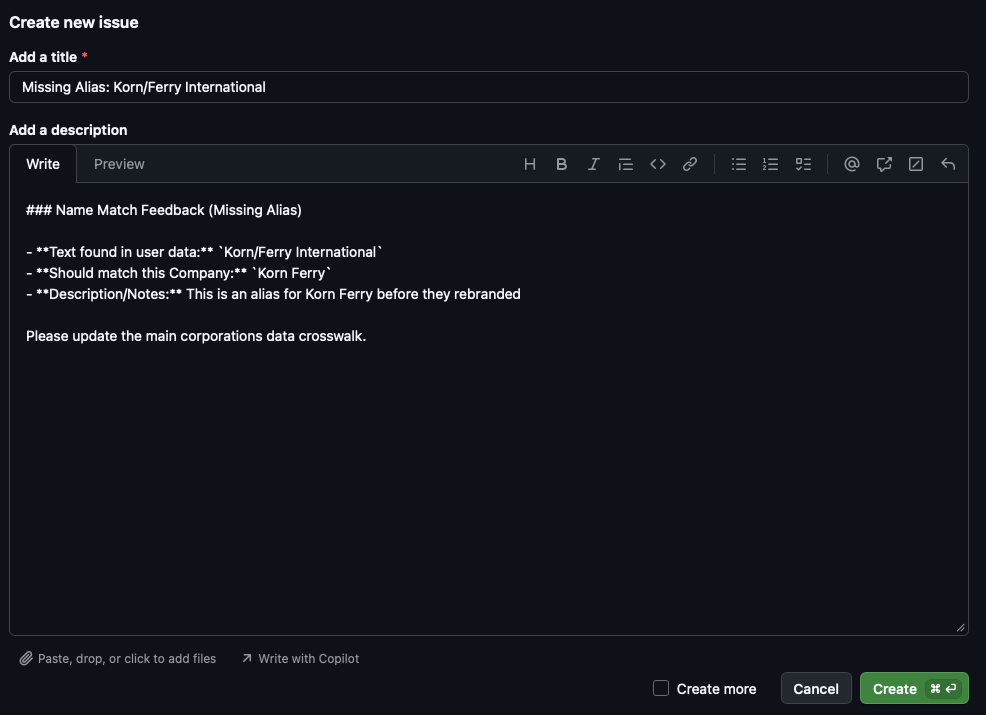

<!--DO NOT EDIT .md file, only README.qmd-->

# corporations 

## Description

The `corporations` `extract()` function is a regular-expression-based
pattern match tool to match vector of text with a built-in extensive
crosswalk table of corporations using the
[regextable](https://github.com/judgelord/regextable) package as a
dependency. The crosswalk table includes companies with a central index
key (a unique 10-digit, permanent identification number assigned by the
U.S. Securities and Exchange Commission), Compustat (database managed by
the S&P Global Market Intelligence), and FDIC-insured companies. The
`extract()` function requires one input

1.  `input_data`: A vector of text to search (typically a data frame
    with a `text` column)

For each matching substring, `corprations::extract` returns

- the row number of `data`
- the `text` column from `data`
- the `pattern`
- the matched substring
- Optionally, other columns in `input_data` or the `corporations_data`
  or similarity scores if `token` method is chosen

## Installation

    devtools::install_github("judgelord/corporations")

``` r
library(corporations)
```

## Corporations Website

The built in crosswalk of corporations does not provide the full list of
aliases that a corporation may have or a certain corporation may not be
included at all. In order to help improve the amount of corporations
that can match with user text, we ask that users feel free to visit our
suggestion website and make suggestions for the crosswalk. This includes
adding additional aliases to corporations or providing entirely new
ones. Note: package maintainers will need to approve suggestions before
adding it to the real database of companies, which may take some time.
[corporations-website](https://github.com/stevenhanwen/corporations-website)

## Text cleaning

Before matching, by default, `clean_text()` from the
[regextable](https://github.com/judgelord/regextable) is applied to
standardize text for better matching in messy text. It converts text to
lowercase, removes excess punctuation, replaces line breaks and dashes
with spaces, and collapses multiple spaces into a single space. Text
cleaning is applied only during matching and does not modify the
original input data. Users can disable this behavior by setting
`do_clean_text = FALSE`.

``` r
text <- "  HELLO---WORLD  "
cleaned_text <- regextable::clean_text(text)
print(cleaned_text)
#> [1] "hello world"
```

## `extract()` function supports two methods of matching:

1.  `exact` (Default): One to one matching of corporation name strings
    between the input user data.

2.  `token`: Token based matching with token scoring function that
    compares words of the string names.

## `extract()` function supports two modes of operation:

1.  `match` (Default): Direct comparison. Best for short strings or
    lists of entities where you expect the text to be a company name.

2.  `search`: Deep extraction. Uses an NLP model (UDpipe) to identify
    Proper Nouns within longer unstructured text (sentences) before
    running the regex match. NOTE: When using mode = “search”, the
    package will prompt you to download a ~15MB NLP model on its first
    run. This model allows the package to “read” the sentence structure.

## Extract regex-based matches from text

### Required Parameters

- **`data`**: A data frame or character vector containing the text to
  search.

### Optional Parameters

- **`col_name`**: (default `"text"`) Column name in the data frame
  containing text to search through.
- **`method`**: (default `exact`) Use “exact” for one to one match of
  name strings or “token” for matching based on a token scoring
  function.
- **`mode`**: (default `match`) Use `match` for direct matching or
  `search` for matching after extraction from longer text.
- **`data_return_cols`**: (default `NULL`) Vector of additional columns
  from `data` to include in the output.
- **`regex_return_cols`**: (default `NULL`) Vector of additional columns
  from `corporations_data` to include in the output (e.g., “FED_RSSD”,
  “CIK”).
- **`remove_acronyms`**: (default `FALSE`) If `TRUE`, removes
  all-uppercase patterns from `regex_table`.
- **`do_clean_text`**: (default `TRUE`) If `TRUE`, cleans text before
  matching.
- **`verbose`**: (default `TRUE`) If `TRUE`, displays progress messages.
- **`unique_match`** (default `FALSE`) If `TRUE`, stops searching after
  first match to find at most one match per row.
- **`cl`**: (default `NULL`) A cluster object or integer specifying
  child processes for parallel evaluation (ignored on Windows).

### Note on `token` method

When this matching method is selected, matches are filtered using a
token verification check. The algorithm identifies “significant” words
(ignoring suffixes like “Inc” or “Corp”) and requires at least a 60%
overlap between the input text and the corporations data entry to be
considered a valid match.

### Returns

A data frame with one row per match, including:

- `row_id`: the internal row number of the text in the input data
- the `col_name` (default “text”) column from `data`
- Optional columns from the input data (if data_return_cols specified)
- Optional columns from `corporations_data` (if regex_return_cols
  specified)
- `pattern`: the regex pattern matched
- `match`: the substring matched in the text
- `simililarity`: this is the similarity matching score if `token`
  method is selected based on Jaro-Winkler Similarity of the filtered
  results for ordering purposes

### Example data 1

This example is for a basic usage of `extract()`. Potential entities are
already extracted to show matching with listed contributors in Project
2025’s “Mandate for Leadership: The Conservative Promise”. This shows
one to one matching of corporations with names that are highly likely to
be corporations, rather than semi-structured text.

``` r
data("project_2025_coalition_and_contributors")
head(project_2025_coalition_and_contributors)
#>           type                        organization individual                  role
#> 1 Organization            Alabama Policy Institute            Advisory Board Member
#> 2 Organization          Alliance Defending Freedom            Advisory Board Member
#> 3 Organization  American Accountability Foundation            Advisory Board Member
#> 4 Organization American Center for Law and Justice            Advisory Board Member
#> 5 Organization                    American Compass            Advisory Board Member
#> 6 Organization           The American Conservative            Advisory Board Member

# Temporarily using load() function because real crosswalk is not pushed to Github
load("data-raw/corporations_data.rda")
head(corporations_data)
#>                                                      aliases cik FED_RSSD ticker naics
#> 1   Defined Asset Funds Municipal Invt Tr Fd New York Ser 33   3       NA           NA
#> 2      Corporate Income Fund Seventy Ninth Short Term Series  13       NA           NA
#> 3  Defined Asset Funds Municipal Invt Tr Fd Mon Pymt Ser 155  14       NA           NA
#> 4  Defined Asset Funds Municipal Invt Tr Fd Mon Pymt Ser 156  17       NA           NA
#> 5 Nuveen Tax Exempt Unit Trust Series 169 National Trust 169  18       NA           NA
#> 6                                   K Tron International Inc  20       NA   KTII    NA
```

### Basic usage of `extract()`

The simplest use of `extract()` with only the required arguments and
specific return columns specified that demonstrate use cases. This finds
all matches in the text column using the `corporations_data` and allows
users to directly link company names with unique identifiers, determine
which are publicly traded companies, and more. If multiple patterns
match the same text, multiple rows are returned, one per match.

``` r
# Extract patterns using only required arguments and the default mode = "match"
result <- corporations::extract(
  data = project_2025_coalition_and_contributors,
  col_name = "organization",
  data_return_cols = c("organization"),
  regex_return_cols = c("cik", "ticker", "naics")
)

result
#> # A tibble: 7 × 7
#>   row_id organization                        cik ticker  naics pattern                                             match
#>    <int> <chr>                             <dbl> <chr>   <dbl> <chr>                                               <chr>
#> 1     47 Patrick Henry College           1205813 ""         NA "\\b(?:patrick henry college)\\b"                   Patr…
#> 2     71 Korn Ferry                        56679 "KFY"  561311 "\\b(?:korn ferry international|korn ferry)\\b"     Korn…
#> 3     73 Taft Stettinius & Hollister LLP  909789 ""         NA "\\b(?:taft stettinius & hollister)\\b"             Taft…
#> 4     76 Booz Allen Hamilton               13222 ""         NA "\\b(?:booz allen & hamilton|booz allen hamilton)\… Booz…
#> 5     78 River Financial Inc.            1641601 ""         NA "\\b(?:river financial)\\b"                         Rive…
#> 6     78 River Financial Inc.            1846407 ""         NA "\\b(?:river financial)\\b"                         Rive…
#> 7     83 Baker Botts, LLP                1127752 ""         NA "\\b(?:baker botts)\\b"                             Bake…
```

### Example data 2

For this `search` mode example, we extract sentences from an excerpt of
a house hearing (01/21/2026) named “Embedded Threats: Foreign Ownership,
Hidden Hardware, and Licensing Failures in America’s Transportation
Systems.” [Full transcript
link](https://www.congress.gov/event/119th-congress/house-event/118875/text).
This data has been pre-processed with each sentence as a row inside the
house_hearing_excerpt tibble.

``` r
data("house_hearing_excerpt")
head(house_hearing_excerpt)
#> # A tibble: 6 × 1
#>   text                                                                                                                 
#>   <chr>                                                                                                                
#> 1 China controls 90 percent of the world’s LiDAR market.                                                               
#> 2 The Chi- nese entities that are leading this charge are companies like Hesai, RoboSense, DJI that the U.S.           
#> 3 Government has already identified as tied to the Chinese military.                                                   
#> 4 Those Chinese military-tied companies sell to GM’s Cruise and Nvidia’s Drive Hyperion.                               
#> 5 Their LiDAR sen- sors have been installed at JFK International Airport and Char- lotte Douglas International Airport.
#> 6 Chinese LiDAR sensors are on intersections in Chattanooga and on drawbridges in Sarasota.
```

### `search` mode usage of `extract()`

For `search` mode, you may add `source_text` as a column inside the
`data_return_cols` parameter to view the full text in which the entity
was extracted from. This only works as expected if the input data is
pre-processed as a tibble with multiple rows. Otherwise, it will return
the entire text data.

``` r
# Extract patterns using only required arguments and the default mode = "match"
result <- corporations::extract(
  data = house_hearing_excerpt,
  col_name = "text",
  mode = "search",
  data_return_cols = c("text"),
  regex_return_cols = c("aliases", "cik", "ticker", "naics")
)

result
#> # A tibble: 5 × 8
#>   row_id text   aliases                        cik ticker  naics pattern                        match 
#>    <int> <chr>  <chr>                        <dbl> <chr>   <dbl> <chr>                          <chr> 
#> 1      1 Chi    Carnival Homes Inc|Chi Inc 1092155 ""         NA "\\b(?:carnival homes|chi)\\b" Chi   
#> 2      7 Nvidia Nvidia Corp/Ca|Nvidia Corp 1045810 "NVDA" 334413 "\\b(?:nvidia/ca|nvidia)\\b"   Nvidia
#> 3     15 Bei    Bei                        1360658 ""         NA "\\b(?:bei)\\b"                Bei   
#> 4     23 FedEx  Fdx Corp|Fedex Corp        1048911 "FDX"  492110 "\\b(?:fdx|fedex)\\b"          FedEx 
#> 5     24 Boeing Boeing Co                    12927 "BA"   336411 "\\b(?:boeing)\\b"             Boeing
```

Note: Notice that there are false positive matches due to corporations
in the crosswalk that have names of the countries mentioned inside the
text data because they were cut off (“Chi” is from “Chi-nese” and “Bei”
is from “Bei-jing”). This would need to be addressed by making sure that
hyphenated words due to end of lines are handled before input data is
used.

## Filtering corporations

The `corporations` package enables exploration of the corporations
crosswalk by limiting your search to specific types of entities (e.g.,
only publicly traded companies or specific industries). The `filter()`
function allows you to subset the internal crosswalk to specific
companies.

### Parameters

- **`naics_codes`**: (default `NULL`) Vector of NAICS codes to filter
  the dictionary. If NULL, all industries are included.
- **`public_only`**: (default `False`) if TRUE, subsets the dictionary
  to only include corporations with stock tickers.
- **`search_term`**: (default `NULL`) Character string; if provided,
  filters the company names using a partial string match
  (case-insensitive).
- **`corporations_return_cols`**: (default
  `c("aliases", "cik", "FED_RSSD")`) Vector of column names to include
  from the built-in corporations data (e.g., “FED_RSSD”, “CIK”).

``` r
# Find public companies in the custom computer programming services sector (NAICS 541511) with stock tickers. 
programming_services_public <- filter(naics_codes = c(541511), public_only = TRUE)
head(programming_services_public)
#>                                           aliases     cik FED_RSSD ticker  naics
#> 161                   Analysts International Corp    6292       NA   ANLY 541511
#> 2638                                      Tsr Inc   98338       NA   TSRI 541511
#> 658841 Glimpse Group, Inc.|Glimpse Group Inc(The) 1854445       NA   VRAR 541511
#> 669824                                   Ci&T Inc 1868995       NA   CINT 541511
#> 744508  Evolving Systems Inc|Symbolic Logic, Inc. 1052054       NA   EVOL 541511
#> 745780       Infosys Ltd|Infosys Technologies Ltd 1067491       NA   INFY 541511
```

## Reporting matching issues

The `report_fix()` function allows users to flag incorrect name matches
or suggest missing aliases through a GitHub issue that is automatically
formatted and prompts the user for questions regarding the report.
However, we highly suggest to do this kind of suggestion on the
[corporations-website](https://github.com/stevenhanwen/corporations-website)
for a more smoother experience. In addition, you will need a GitHub
account to use this reporting method.

### Parameters

- **`results`**: The tibble returned from the extract() function

*Example of automatically formatted GitHub issue after running
`report_fix()`*

